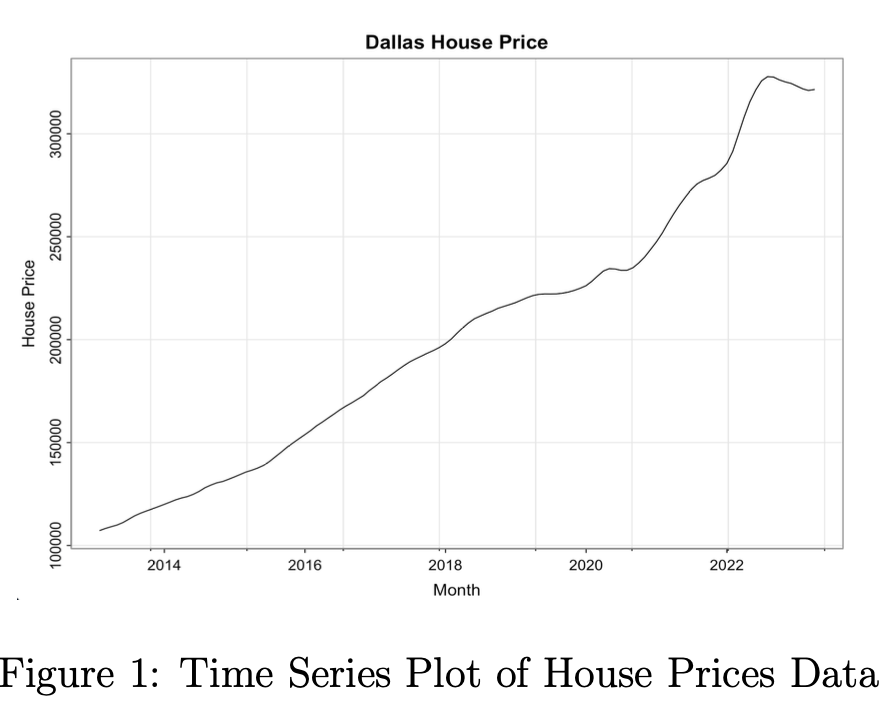
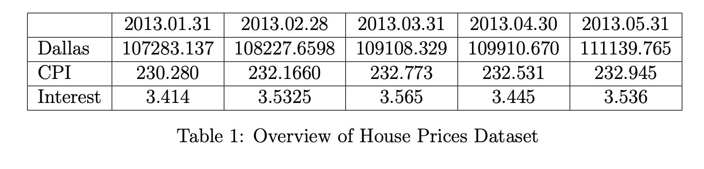
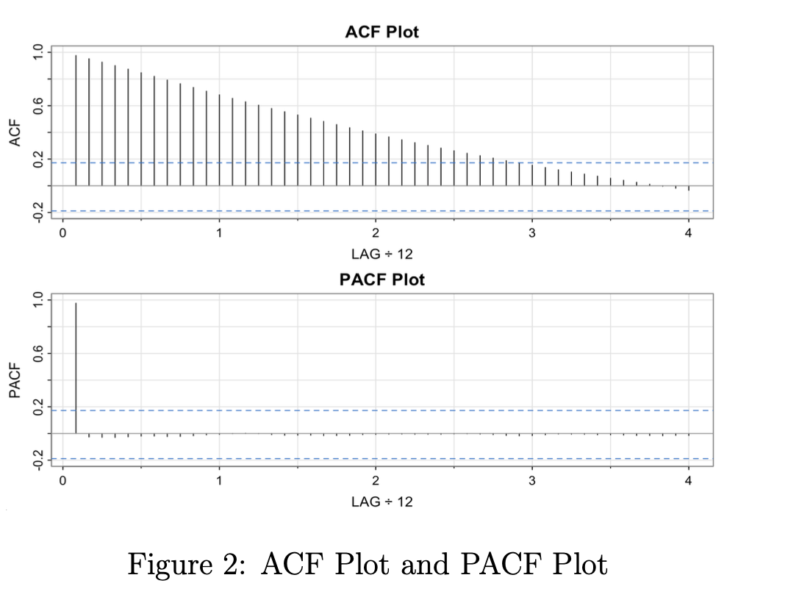
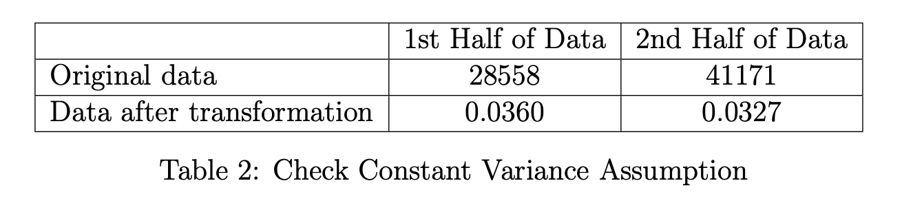
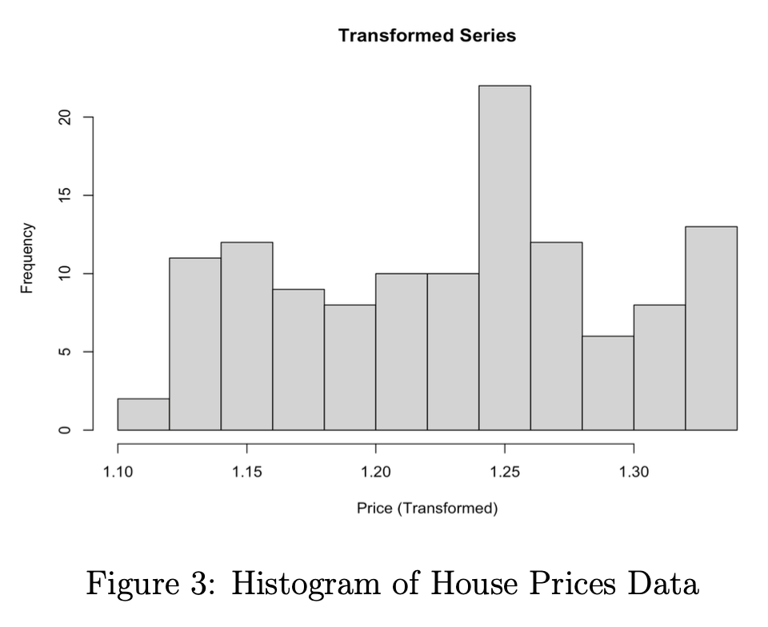
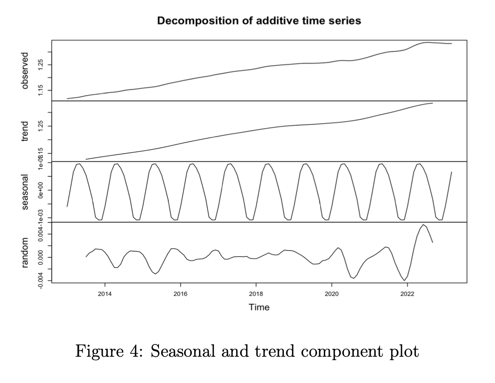
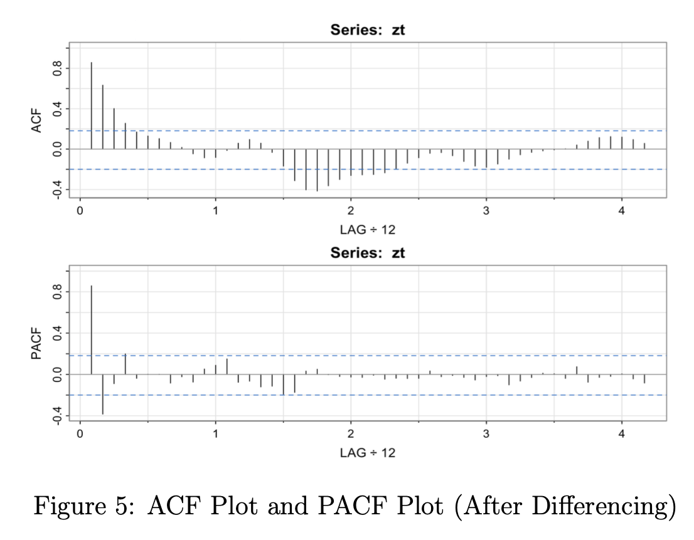
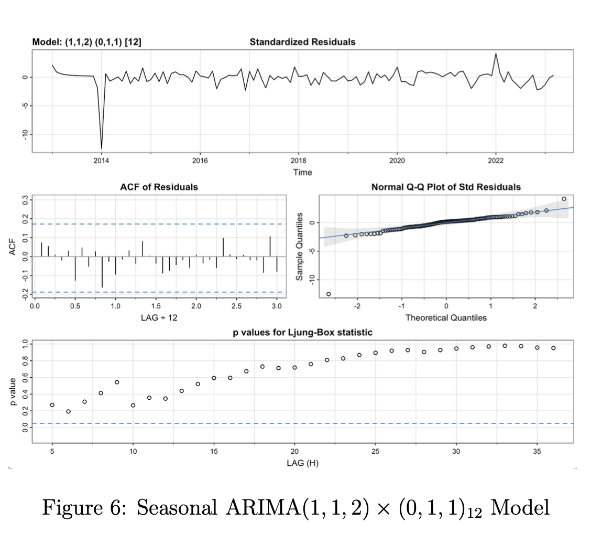
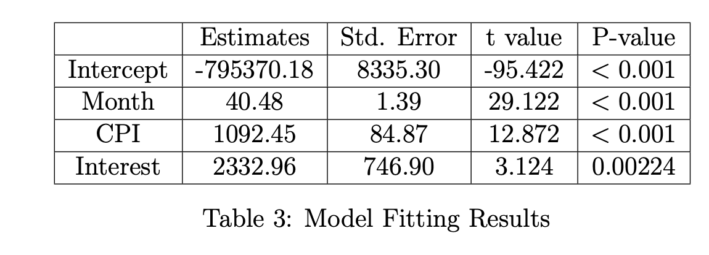
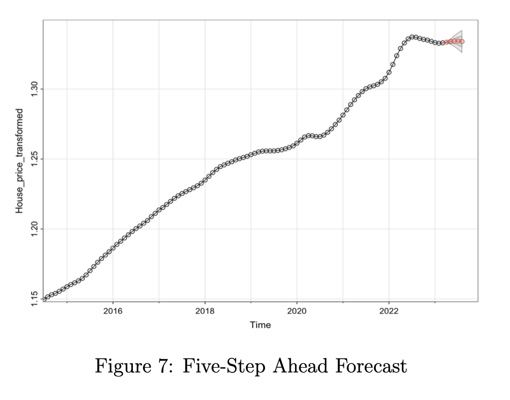

# Time Series Analysis of Dallas House Prices

### 1. Introduction

This project examines Dallas housing market fluctuations over a decade (2013-2023), identifying key price drivers and forecasting future trends.

#### 1.1 Data

Data was collected from three sources: Zillow.com [Dallas monthly house prices](https://www.zillow.com/research/data/), Federal Reserve Bank of St. Louis [CPI](https://fred.stlouisfed.org/series/MORTGAGE30U), and OECD [monthly interest rates](https://stats.oecd.org/index.aspx?queryid=86#). The dataset contains 123 observations spanning January 2013 to March 2023, with three variables: Dallas monthly house prices, CPI, and monthly interest rates.

#### 1.2 Research Questions

a. What are the trends and seasonal patterns in Dallas housing prices over time?

b. Which time series model is appropriate for fitting the housing prices data?

c. Which factors have a significant influence on housing prices over time?

d. What are the predictions for future changes in housing prices?

### 2. Statistical Analysis

#### 2.1 ACF Plot and PACF Plot

The ACF plot (Figure 1) shows gradual tailing off with many significant lags, while the PACF plot cuts off after lag 1, suggesting an AR(1) model is appropriate for this data.

#### 2.2 Data Transformation

Initial analysis revealed non-constant variance with standard deviations of 28558 and 41171 for the first and second halves of the dataset, respectively. After applying a Box-Cox transformation, standard deviations became 0.0360 and 0.0327, satisfying the constant variance assumption.

The histogram in Figure 2 demonstrates that applying the Box-Cox method resulted in modest improvements to the data's normality distribution.

#### 2.3 Structural Regression Model

Figure 3 reveals an increasing trend with distinct 12-month seasonality and some residual seasonal patterns in the random component, indicating need for a model addressing both trend and seasonality.

#### 2.4 Model Building

Dickey-Fuller testing ($H_0: | \phi| = 1; H_1: |\phi| < 1)$ yielded $p$ = 0.01 after first differencing ($d = 1$), confirming stationarity. Figure 5 shows gradually decaying ACF, PACF cutting off after lag 2, and pseudo-sinusoidal ACF patterns suggesting residual seasonality.

Figure 5 shows gradually decaying ACF, PACF cutting off after lag 2, and pseudo-sinusoidal patterns in the ACF suggesting residual seasonality.

We fitted a seasonal ARIMA(1,1,2)×(0,1,1)₁₂ with Interest Rate as a covariate. Residual analysis (Figure 6) shows constant variance except in 2014, white noise characteristics in the ACF plot, and normal distribution in the QQ plot with one outlier. Ljung-Box test p-values mostly exceed significance levels, confirming residual independence and model adequacy.

#### 2.5 Multiple Linear Regression

To check the effect of Month, CPI, and Interest Rate on the house price, we fit a multiple linear regression model. The model can be written as:

$$ X_t = \beta_0 + \beta_1 Z_{t1} + \beta_2 Z_{t2} + \beta_3 Z_{t3} + \epsilon_t$$

Notations:

$X_t$: monthly house prices at time point $t$

$t$: year from 2013 to 2023

$\beta_0$: intercept

$\beta_1$: coefficient for Month

$\beta_2$: coefficient for CPI

$\beta_3$: coefficient for interest rate

$Z_{t1}$: Month

$Z_{t2}$: CPI

$Z_{t3}$: Interest Rate

$\epsilon_t$: white noise time series with mean 0 and variance $\sigma^2$

Table 3 shows that small p-values for Month, CPI, and Interest Rate indicate these factors significantly affect Dallas house prices. Positive coefficients suggest house prices increase with these factors.

#### 2.6 Forecasting

Figure 7 displays a five-step forecast from 2013 to 2023, showing the predicted house price (red line) remains flat, suggesting stability in Dallas house prices from April to August 2023.

### 3. Conclusion

#### 3.1 Summary for Dataset and Data Analysis

Our dataset includes monthly house prices in Dallas, CPI, and Interest Rate from January 2013 to March 2023, totaling 123 observations. We applied transformations to meet constant variance assumptions and fit a structural regression model to uncover trends and seasonal patterns. Using the Dickey-Fuller test, we determined the differencing order for the trend component. After fitting a seasonal ARIMA model, we performed diagnostics with residual plots, ACF plots, and the Ljung-Box test, then used a five-step forecast to predict house price changes.

#### 3.2 Comments for Research Questions

Based on our analysis, we address our research questions:

a. Dallas house prices increased overall from 2013 to 2023, with seasonal patterns every 12 months suggesting seasonal influences.

b. We propose a seasonal ARIMA model $(p = 1, d = 1, q = 2) \times (P = 0, D = 1, Q = 1)_{12}$ with interest rate as a regressor. Diagnostics confirm residuals follow a white noise time series, supporting the model's suitability.

c. A five-step ahead forecast predicts stable Dallas house prices from April to August 2023.

d. Linear regression reveals Month, CPI, and Interest Rate significantly affect house prices, with positive coefficients indicating a positive relationship.
